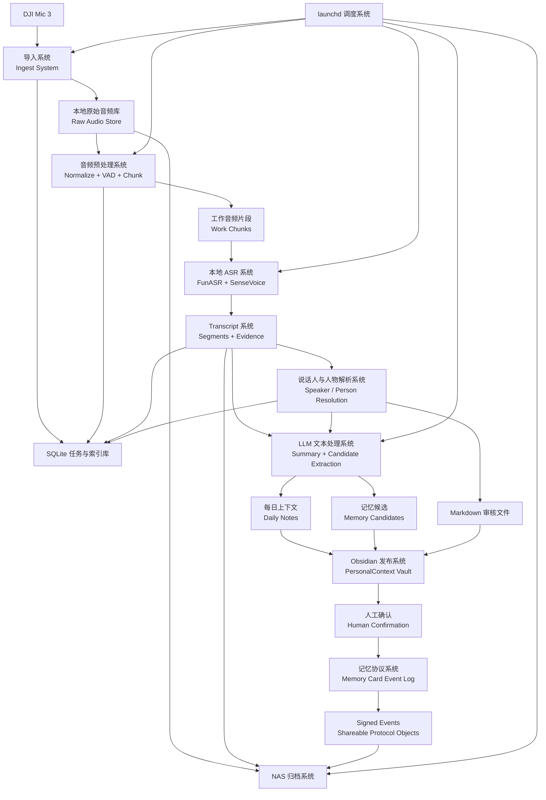
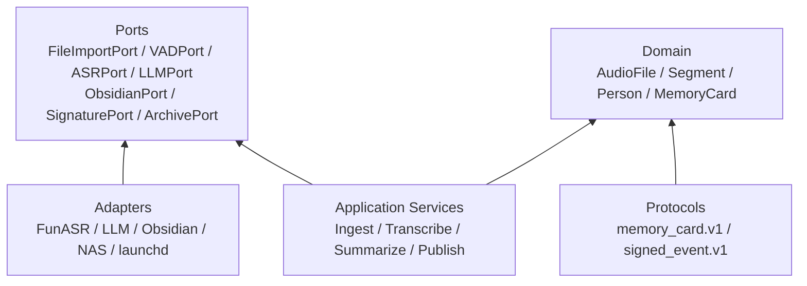
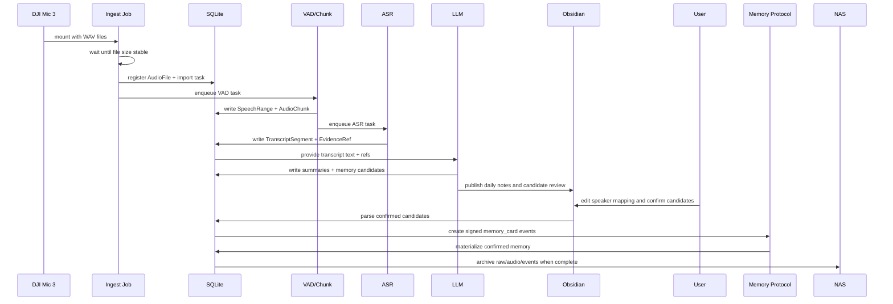

# Personal Context Node 系统设计稿

## 0. 当前阶段

本文是边界核实前的完整设计稿。目标不是立刻实现所有能力，而是把系统拆分、技术栈、协议、边界和联动方式先固定下来，后续实现按本文逐项验收。

当前结论：

| 维度 | 设计决策 |
| --- | --- |
| 核心场景 | 以用户本人为中心的本地录音转上下文系统 |
| 录音设备 | DJI Mic 3，大多数情况下由用户本人佩戴 |
| 数据规模 | 每天 4-8+ 小时录音，有效说话约 10%-30% |
| 语言 | 95% 中文，允许少量方言 |
| 本地边界 | 音频、ASR、说话人处理、原始转写、统计、存储必须本地 |
| LLM 边界 | 仅 LLM 文字处理可使用云端 |
| 人工确认 | 长期记忆必须人工确认 |
| Obsidian | 新 vault：`/Users/paul/Documents/Obsidian/PersonalContext` |
| 多人扩展 | 只共享已确认的原子记忆卡片 |
| 协议方向 | 公钥身份、Ed25519 签名、canonical JSON、signed event log |

## 1. 设计目标与非目标

### 1.1 设计目标

1. 每天插入 DJI Mic 3 后自动导入新增录音。
2. 用本地模型完成 VAD、ASR、必要的说话人处理。
3. 把长音频转成可追溯的结构化 transcript 和每日 Markdown。
4. 通过 LLM 从 transcript 中生成摘要、统计、待办、推断和记忆候选。
5. 长期记忆必须由用户确认后才进入 confirmed memory。
6. confirmed memory 以原子 `memory_card` 形式存在。
7. 系统模块高内聚低耦合，ASR、LLM、存储、Obsidian、NAS 都可替换。
8. 协议层预留未来 5 人本地节点横向拉通能力，但 v1 不实现传输服务。

### 1.2 非目标

1. v1 不做实时转写。
2. v1 不做 Web 审核 UI。
3. v1 不做原始音频共享。
4. v1 不实现 MCP server、HTTP API、P2P 或同步服务。
5. v1 不做端到端加密和复杂权限系统。
6. v1 不保证自动识别所有其他人的真实身份。
7. v1 不把 Apple Reminders、Calendar 作为强依赖。

## 2. 总体架构



### 2.1 架构分层



依赖方向：

```text
domain <- services <- adapters
ports 由 core 定义，adapters 只实现 ports
storage 是 core 基础设施：具体 SQLite 实现，不设 port
protocols 不依赖具体传输方式
```

## 3. 系统划分总览

| 系统 | 核心职责 | 不应承担的职责 |
| --- | --- | --- |
| S1 导入系统 | 发现 DJI、复制新文件、去重、登记任务 | 不做 ASR、不生成摘要 |
| S2 音频预处理系统 | 规范化音频、VAD、切 chunk | 不理解文本语义 |
| S3 本地 ASR 系统 | 把语音 chunk 转 transcript segment | 不做长期记忆 |
| S4 说话人与人物解析系统 | self 默认、speaker mapping、人工修正 | 不决定事实是否进入长期记忆 |
| S5 证据与存储系统 | SQLite、JSONL、证据链、任务状态（core 基础设施，不设 port） | 不绑定具体模型 |
| S6 LLM 文本处理系统 | 摘要、统计、推断、候选记忆 | 不接触原始音频 |
| S7 Obsidian 发布与审核系统 | 生成 Markdown、读回人工修改 | 不拥有事实真相 |
| S8 记忆协议系统 | memory card、annotation、signed event | 不实现传输服务 |
| S9 调度与编排系统 | launchd、幂等 job、失败重试 | 不包含业务逻辑 |
| S10 NAS 归档系统 | 冷归档、hash 校验、清理资格 | 不影响本地处理成功 |
| S11 观测与诊断系统 | 日志、状态、运行报告 | 不修复业务数据 |

## 4. S1 导入系统

### 职责

1. 检测 DJI Mic 3 是否挂载。
2. 查找新增 WAV 文件。
3. 等待文件大小稳定后复制。
4. 计算 hash，写入文件索引。
5. 生成后续处理任务。

### 技术栈

| 组件 | 选型 |
| --- | --- |
| 语言 | Python 3.11 |
| CLI | Typer |
| 文件操作 | pathlib + shutil |
| hash | hashlib sha256 |
| 状态存储 | SQLite |
| macOS 触发 | launchd 周期任务，后续可加挂载检测 |

### 输入输出

| 类型 | 内容 |
| --- | --- |
| 输入 | DJI Mic 3 挂载路径、WAV 文件 |
| 输出 | `AudioFile` 记录、raw audio 本地副本、`imported` 任务状态 |

### 开发要点

1. 导入必须幂等。
2. 不能把复制失败的文件登记为可处理。
3. 文件唯一性使用 `device_file_path + size + mtime + sha256` 组合判断。
4. 原始文件复制后视为只读证据。

### 边界

导入系统只回答“这个文件是否安全进入本地证据库”。它不判断说了什么，也不判断谁说的。

## 5. S2 音频预处理系统

### 职责

1. 将原始音频转成 ASR 友好的工作格式。
2. 执行 VAD，过滤静音。
3. 合并相邻语音段。
4. 切分成可控长度的 ASR chunk。

### 技术栈

| 组件 | 选型 |
| --- | --- |
| 音频转换 | ffmpeg |
| VAD 主选 | FunASR VAD 或 Silero VAD |
| 音频元数据 | ffprobe |
| 工作文件 | `data/audio/work/YYYY-MM-DD/` |

### 输入输出

| 类型 | 内容 |
| --- | --- |
| 输入 | `AudioFile` 原始 WAV |
| 输出 | `SpeechRange`、`AudioChunk`、工作音频文件 |

### 开发要点

1. 先 VAD 后 ASR，避免 8 小时音频直接进模型。
2. VAD 阈值必须配置化。
3. chunk 需要保留原始音频时间偏移。
4. 工作音频可重建，不作为长期唯一证据。

### 边界

预处理系统只负责声学切分，不生成 transcript，不接触 LLM。

## 6. S3 本地 ASR 系统

### 职责

1. 调用本地 ASR backend。
2. 把 chunk 转成 transcript segment。
3. 保存文本、时间戳、置信度、backend 信息。
4. 支持 ASR backend 可替换。

### 技术栈

| 组件 | 主选 | 备选 |
| --- | --- | --- |
| ASR | FunASR + SenseVoice | faster-whisper large-v3-turbo |
| Python 依赖管理 | uv | pip-tools |
| 模型缓存 | 本地模型目录 | Hugging Face / ModelScope 缓存 |
| 任务失败 | SQLite task retry | 手动 CLI retry |

### 输入输出

| 类型 | 内容 |
| --- | --- |
| 输入 | `AudioChunk` |
| 输出 | `TranscriptSegment` |

### 开发要点

1. 定义 `ASRPort`，模型适配器只返回统一结果。
2. transcript segment 必须包含 `source_audio_file_id`、`chunk_id`、`start_ms`、`end_ms`。
3. 由于用户本人佩戴麦克风，默认 speaker prior 为 `self`。
4. 记录 `model_name`、`model_version`、`decode_config`，便于重跑比较。

### 边界

ASR 系统只负责“语音到文字”。它不负责总结，不负责长期记忆，也不直接写 Obsidian。

## 7. S4 说话人与人物解析系统

### 职责

1. 维护 `speaker_cluster` 与 `person` 的映射。
2. 支持 `self` 默认归因。
3. 支持人工合并多个 speaker cluster。
4. 支持在 segment 级别拆分误合并 speaker。
5. 必要时触发 diarization。

### 技术栈

| 组件 | 选型 |
| --- | --- |
| diarization 主选 | FunASR CAM++ |
| diarization 备选 | pyannote |
| 人工修正介质 | Markdown |
| 状态存储 | SQLite |

### 输入输出

| 类型 | 内容 |
| --- | --- |
| 输入 | `TranscriptSegment`、可选 diarization result、Markdown 修正 |
| 输出 | `PersonAttribution`、speaker mapping、segment override |

### 开发要点

1. 不强求第一版识别其他人真实姓名。
2. `spk_002 -> 王总` 和 `spk_003 -> 王总` 表示合并。
3. segment override 优先级高于 cluster mapping。
4. 原始 speaker cluster 结果不可覆盖，只能 materialize 修正视图。

### 边界

这个系统只解决“这段话归谁”。它不决定这段话是否成为事实或记忆。

## 8. S5 证据与存储系统

### 职责

1. 保存任务状态。
2. 保存 audio、chunk、segment、speaker、summary、candidate、event。
3. 提供证据追溯能力。
4. 为幂等调度提供状态机。

### 技术栈

| 组件 | 选型 |
| --- | --- |
| 主数据库 | SQLite |
| schema 管理 | 自定义顺序 SQL migrations + `schema_migrations` 表 |
| ORM/查询 | SQLAlchemy Core |
| 交换日志 | JSONL |
| schema 校验 | Pydantic v2 |

### 核心状态

状态机拆分见第 25 节：AudioFile 生命周期、Task 生命周期、DailyReport 生命周期是三条独立状态机，不再使用单一混合状态列。

### 开发要点

1. SQLite 是本地事实索引，不是协议本身。
2. JSONL 是可审计导出，不替代数据库。
3. 每个派生对象都必须能追溯到上游证据。
4. 删除策略只能删除可重建工作文件，不能删除未归档 raw evidence。

### 边界

存储系统不包含业务推理。它只保存状态、证据和 materialized view。

## 9. S6 LLM 文本处理系统

### 职责

1. 对 transcript 做 chunk summary。
2. 生成 session summary 和 daily summary。
3. 提取 todo、decision、fact、inference。
4. 生成 memory candidate。
5. 区分事实与推断。

### 技术栈

| 组件 | 选型 |
| --- | --- |
| LLM 接口 | `LLMPort` |
| 云端模型 | OpenAI API 可选 |
| 本地模型 | Ollama / llama.cpp / MLX 可选 |
| 输出校验 | Pydantic schema |
| prompt 管理 | 版本化 prompt 文件 |

### 输入输出

| 类型 | 内容 |
| --- | --- |
| 输入 | transcript text、speaker attribution、evidence refs |
| 输出 | summary、statistics、memory candidates |

### 开发要点

1. LLM 不接触原始音频。
2. 每个自动生成的 memory candidate 必须有 `evidence_refs`。
3. 推断必须标记为 `inference`，并带 confidence。
4. 长文本必须分层处理：chunk -> session -> daily。
5. prompt 版本要进入结果元数据。

### 边界

LLM 系统可以提出候选，但不能直接写入长期记忆。

## 10. S7 Obsidian 发布与审核系统

### 职责

1. 创建和维护 PersonalContext vault 目录。
2. 写入每日笔记、session 笔记、speaker review、memory candidate review。
3. 读取用户在 Markdown 中做的确认和修正。
4. 将人工确认同步回 SQLite 和 memory event log。

### 技术栈

| 组件 | 选型 |
| --- | --- |
| 文件格式 | Markdown |
| vault 路径 | `/Users/paul/Documents/Obsidian/PersonalContext` |
| frontmatter | YAML |
| Markdown 解析 | markdown-it-py 或正则限定块解析 |

### Vault 结构

```text
/Users/paul/Documents/Obsidian/PersonalContext/
  00_Inbox/
  10_Daily/
  20_Conversations/
  30_Memory_Candidates/
  40_Confirmed_Memory/
  90_System/
```

### 开发要点

1. 绝不写入 `/Users/paul/Documents/Obsidian/Supcon`。
2. 生成区块使用明确 marker，便于重复生成。
3. 人工编辑区和系统生成区分开。
4. 读回 Markdown 时只解析协议化块，不猜测自由文本。

### 边界

Obsidian 是人机审核界面，不是唯一事实库。事实库仍由 SQLite 和 signed event log 支撑。

## 11. S8 记忆协议系统

### 职责

1. 定义 `memory_card.v1`。
2. 定义 `memory_annotation.v1`。
3. 定义 `signed_event.v1`。
4. 管理公钥身份。
5. 生成和验证签名。
6. 从 event log materialize 当前记忆状态。

### 技术栈

| 组件 | 选型 |
| --- | --- |
| 身份 | 公钥身份，`did:key` 风格 ID |
| 签名算法 | Ed25519 |
| 签名库 | cryptography |
| canonical JSON | RFC 8785 / JCS 兼容实现 |
| ID | ULID，带类型前缀 |
| schema | JSON Schema + Pydantic |

### 协议原则

1. `memory_card` 是原子 claim。
2. `memory_card` 归 owner 所有。
3. 他人只能 annotation，不能编辑 owner 的 card。
4. 自动生成的 card 必须有 evidence。
5. 确认候选时允许修改 claim，但保留 `candidate_claim`。
6. 语义变化必须新建 card 并 supersede 旧 card。
7. 所有可共享对象都通过 signed event log 表达。
8. v1 只做签名，不做加密。
9. 签名对象只包含 did，不内嵌 display name：display name 的唯一权威来源是 `identity_profile.published`，渲染时解析（按 44 节信任引导，信任任何人之前必然已持有其 profile）。

### 边界

协议系统不关心事件如何传输。文件、NAS、Git、HTTP、MCP 都是未来 adapter。

## 12. S9 调度与编排系统

### 职责

1. 用 `launchd` 定时触发任务。
2. 每次启动后检查是否有新工作。
3. 根据 SQLite 状态推进任务。
4. 失败任务可重试。

### 技术栈

| 组件 | 选型 |
| --- | --- |
| macOS 调度 | launchd |
| 命令入口 | Typer CLI |
| 日志 | Python logging + JSON log |
| job 状态 | SQLite |

### Job 设计

| Job | 触发 | 规则 |
| --- | --- | --- |
| ingest | 周期执行，有 DJI 新文件才工作 | 无新文件立即退出 |
| process | 周期执行，有 pending task 才工作 | 支持断点续跑 |
| daily | 每天固定时间 | 当天无新数据则跳过 |
| archive | 周期或处理完成后 | NAS 不可用则 pending |

### 边界

调度系统只负责推进状态，不承载业务逻辑。

## 13. S10 NAS 归档系统

### 职责

1. 把 raw audio、transcript、summary、signed event 归档到 NAS。
2. 校验 hash。
3. 标记 `archived`。
4. 支持本地 hot cache 清理资格。

### 技术栈

| 组件 | 选型 |
| --- | --- |
| 同步 | rsync 或 restic |
| 校验 | sha256 manifest |
| 状态 | SQLite archive table |

### 开发要点

1. NAS 不可用不能阻塞本地 ASR 和日报生成。
2. 未归档 raw audio 不允许自动删除。
3. 工作音频可删除，raw audio 按策略保留。

### 边界

NAS 是冷归档，不是在线数据库。

## 14. S11 观测与诊断系统

### 职责

1. 记录每次 job 的 run id。
2. 输出任务状态、失败原因、耗时、模型版本。
3. 提供 CLI 查看 pending、failed、archived。
4. 生成每日系统运行摘要。

### 技术栈

| 组件 | 选型 |
| --- | --- |
| 日志 | JSON lines |
| CLI | Typer |
| 指标 | SQLite 聚合 |
| Debug 输出 | Markdown 或 terminal table |

### 边界

观测系统只报告，不自动改业务数据。

## 15. 系统联动设计

### 15.1 主链路



### 15.2 数据流分层

```text
raw evidence:
  raw wav -> normalized chunk -> transcript segment

derived context:
  transcript segment -> chunk summary -> session summary -> daily summary

reviewed memory:
  memory candidate -> confirmed memory card -> signed event

archive:
  raw wav + transcript + summary + signed events -> NAS
```

### 15.3 模块间通信规则

| 规则 | 说明 |
| --- | --- |
| 只通过 domain object 或 port 传递 | 不把第三方 SDK 对象传入 core |
| 任务状态写 SQLite | job 之间不靠内存通信 |
| 大文件走文件路径 + hash | 不把音频 blob 塞进数据库 |
| LLM 只收文本和 metadata | 不把 raw audio 发给 LLM |
| 共享只通过 signed event | 不共享 SQLite 内部表 |

## 16. 核心数据对象

### 16.1 AudioFile

```json
{
  "audio_file_id": "aud_01J00000000000000000000000",
  "source_device": "DJI Mic 3",
  "source_path": "/Volumes/DJI/.../REC001.WAV",
  "local_raw_path": "data/audio/raw/2026-06-10/REC001.WAV",
  "sha256": "sha256:...",
  "duration_ms": 1800000,
  "recorded_at": "2026-06-10T10:00:00+08:00",
  "imported_at": "2026-06-10T20:00:00+08:00",
  "status": "imported"
}
```

### 16.2 TranscriptSegment

```json
{
  "segment_id": "seg_01J00000000000000000000000",
  "audio_file_id": "aud_01J00000000000000000000000",
  "chunk_id": "chk_01J00000000000000000000000",
  "session_id": "ses_01J00000000000000000000000",
  "start_ms": 123400,
  "end_ms": 130800,
  "absolute_start_at": "2026-06-10T10:02:03+08:00",
  "absolute_end_at": "2026-06-10T10:02:10+08:00",
  "text": "这个方案我们下周再看。",
  "language": "zh",
  "speaker_cluster_id": "spk_01J00000000000000000000000",
  "confidence": 0.86,
  "asr_backend": "funasr_sensevoice",
  "model_name": "sensevoice",
  "model_version": "sensevoice",
  "created_at": "2026-06-10T20:15:00+08:00"
}
```

### 16.3 MemoryCandidate

```json
{
  "candidate_id": "cand_01J00000000000000000000000",
  "candidate_claim": "用户要求 ASR 和原始转写必须本地运行。",
  "claim_type": "requirement",
  "subject": {
    "type": "project",
    "id": "project_personal_context_node",
    "label": "Personal Context Node"
  },
  "confidence": 0.93,
  "evidence_refs": ["ev_01J00000000000000000000000"],
  "status": "pending_review"
}
```

evidence 引用形状的统一规则：内部对象（candidate、segment、summary 等）只以 `evidence_id` 字符串引用证据，详情存 `evidence_refs` 表；协议对象（`memory_card.v1`）内嵌自包含 evidence 元数据，因为共享接收方无法访问 owner 的本地库。

## 17. Memory Card v1 协议

### 17.1 Memory Card

```json
{
  "schema_version": "memory_card.v1",
  "card_id": "mem_01J00000000000000000000000",
  "owner": "did:key:z6Mk...",
  "subject": {
    "type": "project",
    "id": "project_personal_context_node",
    "label": "Personal Context Node"
  },
  "claim_type": "decision",
  "claim": "v1 的本地 ASR 主 backend 采用 FunASR + SenseVoice。",
  "source_type": "confirmed_generated",
  "candidate_claim": "用户可能使用 FunASR 作为本地 ASR。",
  "confidence": 0.91,
  "evidence_refs": [
    {
      "evidence_id": "ev_01J00000000000000000000000",
      "visibility": "private",
      "summary": "Derived from local transcript on 2026-06-10."
    }
  ],
  "observed_at": "2026-06-10T16:40:00+08:00",
  "valid_from": "2026-06-10",
  "valid_until": null,
  "visibility": {
    "type": "private"
  },
  "tags": ["asr", "local-first"],
  "created_at": "2026-06-10T17:10:00+08:00",
  "updated_at": "2026-06-10T17:10:00+08:00"
}
```

### 17.2 Claim Type

```text
fact
preference
decision
commitment
requirement
observation
todo
relationship
```

### 17.3 Subject Type

```text
self
person
project
org
topic
system
relationship
```

### 17.4 Annotation

```json
{
  "schema_version": "memory_annotation.v1",
  "annotation_id": "ann_01J00000000000000000000000",
  "target_card_id": "mem_01J00000000000000000000000",
  "author": "did:key:z6Mk...",
  "annotation_type": "confirm",
  "body": "我确认这是当前 v1 的 ASR 选择。",
  "created_at": "2026-06-10T17:00:00+08:00"
}
```

`annotation_type`:

```text
confirm
dispute
comment
supersede_reference
```

### 17.5 Visibility

`visibility` 必须是可扩展对象，不使用固定字符串枚举。

```json
{
  "type": "private"
}
```

v1 定义的 `visibility.type`：

```text
private
public
direct
group
```

示例：

```json
{
  "type": "group",
  "group_id": "grp_01J00000000000000000000000"
}
```

规则：

1. 未知 `visibility.type` 必须 fail-closed，按 `private` 处理。
2. v1 不实现群组系统；`group` 只是协议预留。
3. `visibility` 是声明性 metadata，不是访问控制实现。
4. 真正的选择性可见性必须由未来加密层保证，不能依赖 relay 或文件分发者。

### 17.6 人物引用规则

共享 card 中的人物引用必须经过间接层，不能直接复用本地 `person_id` 或本地真实姓名。

允许两种人物引用：

```json
{
  "kind": "network_member",
  "did": "did:key:z6Mk...",
  "display_hint": "Alice"
}
```

```json
{
  "kind": "card_local_alias",
  "alias_id": "alias_mem_01J00000000000000000000000_p1",
  "label": "Person A"
}
```

规则：

1. 如果对方是网络成员，使用其 DID 引用。
2. 如果对方不是网络成员，使用每张 card 内局部化名。
3. 共享 claim 文本中不得出现非网络成员的真实姓名；应使用 `Person A` 这类 alias label。
4. 本地 `per_*` 与真实姓名只存在于本节点私有库，不进入共享协议。
5. 这条规则适用于 `subject`、`claim`、`evidence_refs.summary` 和 annotation 正文。
6. `display_hint` 仅为渲染提示，非权威；网络成员的权威名称来自其 `identity_profile.published`。

## 18. Signed Event v1 协议

### 18.1 签名规则

| 项 | 规则 |
| --- | --- |
| 身份 | 公钥身份 |
| 签名算法 | Ed25519 |
| 签名输入 | canonical JSON event signing body |
| 编码 | base64url |
| 加密 | v1 不做 |
| 对象 ID | `mem_`、`ann_`、`ev_` + ULID |
| 事件身份 | 无独立 event_id；事件身份就是 `event_hash` |

签名输入不是单独的 `payload`，而是除 `signature` 外的 event signing body。这样 `event_type`、`object_id`、`owner_sequence`、`prev_event_hash`、`payload_encoding` 等 envelope 字段都会被签名保护。

### 18.2 Event Envelope

```json
{
  "envelope_version": "signed_event.v1",
  "event_type": "memory_card.created",
  "object_id": "mem_01J00000000000000000000000",
  "object_version": 1,
  "owner_id": "did:key:z6Mk...",
  "owner_sequence": 1,
  "prev_event_hash": null,
  "payload_type": "memory_card.v1",
  "payload_encoding": "plain",
  "payload": {},
  "created_at": "2026-06-10T17:10:00+08:00",
  "signature": {
    "algorithm": "Ed25519",
    "public_key_id": "did:key:z6Mk...",
    "value": "base64url-signature"
  }
}
```

事件没有独立 ID：事件身份就是 `event_hash = sha256(canonical_json(signing_body))`，跨事件引用（如 `prev_event_hash`、`predecessor.rotation_event_hash`）一律使用 hash。

### 18.3 Event Type

```text
identity_profile.published
identity_key.rotated
memory_card.created
memory_card.metadata_updated
memory_card.superseded
memory_card.revoked
memory_annotation.created
memory_annotation.revoked
```

确认候选只产生一条 `memory_card.created`：卡片只在人工确认后才进入事件流，出生即 confirmed，来源由 payload 的 `source_type`（`confirmed_generated` / `manual`）表达。协议中不存在独立的 confirmed 事件。

### 18.4 事件约束

1. 每个作者维护独立 `owner_sequence` 和 `prev_event_hash` 链。
2. `memory_card.created` 必须由 card owner 签名。
3. `memory_card.metadata_updated` 只能改 metadata，不能改 claim 语义。
4. claim 语义变化必须创建新 card，并由 `memory_card.superseded` 连接旧 card。
5. `memory_annotation.created` 必须由 annotation author 签名。
6. 导入事件必须先验签，再进入可信 materialized view。
7. materialized view 必须是 trusted event set 的确定性函数，与事件到达顺序无关。
8. 对未知目标的 annotation 先进入 dangling 状态；目标 card 到达后再确定性 materialize。
9. 对已 revoked 或 superseded card 的迟到 annotation 附着到历史 card，不改变 current active view。
10. `memory_card.revoked` 是建议性撤回：合规节点应隐藏或标记 revoked，但协议不能保证删除已复制副本。

### 18.5 Payload Encoding

v1 只实现明文 payload：

```json
{
  "payload_encoding": "plain",
  "payload": {}
}
```

为未来加密预留：

```json
{
  "payload_encoding": "encrypted",
  "payload_ciphertext": "base64url...",
  "encryption": {
    "scheme": "reserved",
    "recipients": []
  }
}
```

规则：

1. v1 节点遇到 `payload_encoding = "encrypted"` 时，可以验签 envelope，但不能 materialize payload。
2. 未知 `payload_encoding` 必须 fail-closed，不进入 readable materialized view。
3. 加密方案、群组密钥、MLS、收件人管理都不属于 v1。

## 19. MCP 化预留边界

当前不实现 MCP server，但协议设计需要能自然映射为 MCP resources/tools。

### 19.1 可映射 Resources

| Resource | 内容 |
| --- | --- |
| `memory_cards` | confirmed memory cards 的 materialized view |
| `memory_events` | signed event log |
| `memory_annotations` | annotations |
| `identity_profiles` | 公钥身份资料 |
| `evidence_metadata` | 可共享的 evidence metadata，不含原始音频 |

### 19.2 可映射 Tools

| Tool | 行为 |
| --- | --- |
| `verify_event` | 验证 signed event |
| `materialize_memory` | 从 event log 生成当前 memory view |
| `create_annotation` | 对他人 card 创建 annotation |
| `export_memory_events` | 导出本节点 shareable events |
| `import_memory_events` | 导入并验签外部 events |

### 19.3 边界

MCP adapter 只能包协议对象，不能直接暴露 SQLite 私有表、raw transcript 或 raw audio。

## 20. 开发优先级


推荐先实现 mock ASR end-to-end，再接真实 FunASR。原因是这能先验证边界、状态机、Obsidian、memory 协议，不把第一阶段风险集中到模型安装上。

## 21. 边界核实清单

以下边界已逐项核实定案（2026-06-11 盘问定稿）：

| # | 边界 | 结论 |
| --- | --- | --- |
| 1 | 系统拆分 | 保留 11 个职责域作为文档与边界语言；代码实现为单包 modular monolith（见 24.3），存储为 core 基础设施，不设 StoragePort |
| 2 | 技术栈 | 接受 Python 3.11 + Typer + SQLite + Pydantic + SQLAlchemy Core；migration 用自定义顺序 SQL（见 24.1） |
| 3 | ASR 主选 | FunASR + SenseVoice，faster-whisper 备选；待 34.2 实测核实 |
| 4 | VAD | FunASR VAD 主选，Silero 备选 |
| 5 | Obsidian | 只作为审核和阅读层，不是唯一事实库 |
| 6 | Memory Card | 保持原子 claim |
| 7 | 共享协议 | signed event log 是唯一可共享协议 |
| 8 | v1 范围 | 继续排除 Web UI、传输服务、加密和实时转写 |
| 9 | MCP | 只做协议预留，v1 不实现 |
| 10 | 第一里程碑 | mock ASR 端到端先行；mock 入口用 fixture 目录走真实导入代码（见 33） |
| 11 | 每作者事件链 | 是，v1 协议地基（见 31.2） |
| 12 | visibility | 可扩展对象 + 未知类型 fail-closed（见 17.5） |
| 13 | 人物引用 | 共享 card 禁止本地真实姓名（见 17.6） |
| 14 | 密钥轮换 | 旧 key 签发轮换、封旧链、新链继承权威（见 41） |
| 15 | 协议演化 | must-ignore 未知字段、保留 raw event、未知 event_type 不 materialize（见 42） |
| 16 | 撤回 | revoked 是建议性撤回，不是远程删除（见 45） |
| 17 | 身份字段 | 签名对象只含 did，不内嵌 display name；权威名称来自 identity_profile（见 11、17.6） |
| 18 | 事件身份 | 无独立 event_id，事件身份就是 event_hash（见 18.2） |
| 19 | 存储去冗余 | segments 纯证据 + overrides 表 + 归因 VIEW；删 archive_status、mapping 时间列、evidence visibility 列（见 27.1） |
| 20 | 流水线拓扑 | 声明式中心 PIPELINE，handler 不知道下游；date_key 单点计算（见 25.4） |
| 21 | 审核消费 | candidate review block 是一次性命令，消费后改写为只读回执；speaker mapping 是声明式幂等同步（见 29.4） |

## 22. 当前设计的最大风险

| 风险 | 判断 | 缓解 |
| --- | --- | --- |
| FunASR 在 Apple Silicon 上安装或性能不稳定 | 中 | 保持 faster-whisper adapter 边界 |
| 8+ 小时音频导致处理时间过长 | 中 | 先 VAD，chunk 级任务，断点续跑 |
| 说话人误判污染记忆 | 高 | 默认 self 但保留 evidence，人工确认长期记忆 |
| LLM 过度推断 | 高 | facts/inferences 分离，confidence + evidence |
| 协议过度设计拖慢 v1 | 中 | 只实现 signed event 必需子集，不实现传输 |
| Markdown 解析不稳定 | 中 | 只解析 marker 块和 YAML，不解析自由文本 |

## 23. 建议的第一实现切片

第一切片只做最小可验证闭环：

```text
mock audio file
  -> register in SQLite
  -> mock VAD ranges
  -> mock transcript segments
  -> generate daily Markdown
  -> generate memory candidate
  -> manually confirm candidate
  -> emit signed memory_card event
```

验收标准：

1. 不需要安装 FunASR 也能跑通。
2. 能证明系统边界没有互相侵入。
3. 能证明 evidence 到 memory card 可追溯。
4. 能证明 signed event log 可以 materialize 当前 confirmed memory。

真实音频和 FunASR 接入放在第二切片。

## 24. 第一切片可实施补充

本节补齐 mock E2E 开工前必须定稿的内容。它优先服务第一切片，不试图覆盖真实 DJI 和真实 FunASR 的全部不确定性。

### 24.1 统一工程决策

| 项 | v1 决策 |
| --- | --- |
| 主语言 | Python 3.11 |
| 依赖管理 | uv |
| CLI | Typer |
| 数据库 | SQLite |
| DB 访问 | SQLAlchemy Core |
| 数据模型校验 | Pydantic v2 |
| 配置文件 | `config/local.toml` |
| 本地私钥 | v1 存文件，路径由配置指定；权限 `0600` |
| ID | ULID |
| 时间格式 | ISO 8601，带 timezone |
| 代码包名 | `personal_context` |
| 测试框架 | pytest |
| Markdown 测试 | golden file 对比 |
| schema migration | 自定义顺序 SQL 文件 + `schema_migrations` 表 |

### 24.2 ID 前缀表

| 对象 | 前缀 |
| --- | --- |
| audio file | `aud_` |
| audio chunk | `chk_` |
| transcript segment | `seg_` |
| session | `ses_` |
| person | `per_` |
| speaker cluster | `spk_` |
| evidence | `ev_` |
| memory candidate | `cand_` |
| memory card | `mem_` |
| annotation | `ann_` |
| task | `task_` |
| run | `run_` |
| model run | `mr_` |

### 24.3 代码目录

```text
personal-context-node/
  pyproject.toml
  uv.lock
  config/
    local.example.toml
  src/
    personal_context/
      cli/
        main.py
      core/
        domain/
        ports/
        services/
      storage/
      adapters/
        obsidian_markdown/
        asr_mock/
        asr_funasr/
        vad_mock/
        vad_funasr/
        llm_mock/
        llm_openai/
        archive_nas/
      protocols/
        ids.py
        canonical_json.py
        signing.py
        schemas/
      migrations/
  tests/
    unit/
    integration/
    golden/
    fixtures/
      fake_dji/
  data/
    db/
    audio/
    transcripts/
    exports/
  docs/
```

`storage/` 是 core 基础设施的具体 SQLite 实现（repository、migration runner），不在 `adapters/` 之下，也不设 port（见 28 节）。

## 25. 状态机拆分

原设计中的状态混合了文件级状态、任务级状态和日报级状态。v1 拆成三条独立状态机。

### 25.1 AudioFile 生命周期

```text
discovered        -> importing
importing         -> imported | import_failed
import_failed     -> importing            (重试)
imported          -> archived             (NAS 校验通过)
archived          -> cleanup_eligible     (满足保留策略)
cleanup_eligible  -> locally_removed
```

规则：

1. `imported` 只表示原始文件已安全复制并登记。
2. `archived` 只表示 raw audio 已经同步到 NAS 并通过 hash 校验。
3. `cleanup_eligible` 不等于删除，只表示允许清理策略处理。

### 25.2 Task 生命周期

```text
pending
  -> claimed
  -> running
  -> succeeded
  -> failed_retryable
  -> failed_terminal
  -> cancelled
```

规则：

1. 每个处理步骤都是 task，不把处理状态塞进 `audio_files.status`。
2. task 使用 `task_type + target_type + target_id` 去重。
3. `claimed_by_run_id` 和 `claimed_at` 用于并发认领。
4. 进程被 kill 后，超过 lease 的 `claimed/running` task 可回收为 `pending`。

### 25.3 DailyReport 生命周期

```text
not_started
  -> generating
  -> generated
  -> review_pending
  -> review_synced
  -> failed
```

规则：

1. `daily` 是按日期聚合，不挂在单个音频文件上。
2. 录音跨午夜时，默认按 `session.started_at` 归属 daily。
3. 跨午夜规则可配置，但第一版不自动拆同一 session。

### 25.4 Task 类型与流水线 DAG

`task_type` 是封闭枚举。导入是入口动作（`pcn ingest import` 直接执行，不是 task），导入成功后为每个新 audio file 登记流水线的第一个 task。

| task_type | target_type | 产出 | 成功后登记 |
| --- | --- | --- | --- |
| `vad` | audio_file | AudioChunk + 工作音频 | 为每个 chunk 登记 `asr` |
| `asr` | audio_chunk | TranscriptSegment（活跃集） | 收尾检查：该 audio_file 全部 chunk 转写完成后，为涉及的每个 date_key 登记 `session_derive` |
| `session_derive` | date_key | 重推导该日 session（按 26.2 稳定复用） | 为该日每个 session 登记 `summarize_session` |
| `summarize_session` | session | session summary + 候选（经 37.2 去重入库） | 收尾检查：该日全部 session 完成后登记 `daily_generate` |
| `daily_generate` | date_key | daily summary + 统计 + `daily_reports` 行 | 登记 `obsidian_publish` |
| `obsidian_publish` | date_key | daily / session / candidate review / speaker review 笔记 | 无 |
| `archive` | audio_file 等 | NAS 副本 + 校验（第二切片后启用） | 无 |

上表是 `PIPELINE` 常量的文档形式。规则：

1. 拓扑唯一声明在一个常量结构 `PIPELINE` 中（每条边：上游 task_type、下游 task_type、fan-in 谓词、target 映射）；task handler 只产出结果，不知道下游是谁。
2. 调度器在 task 成功的同一个 SQLite 事务内查 `PIPELINE` 登记下游。
3. fan-in（多对一）由边上的谓词表达：上游成功时调度器评估谓词（如“该 audio_file 全部 chunk 已转写”），满足才登记下游；`UNIQUE(task_type, target_type, target_id)` 保证并发下只登记一次。
4. `date_key` 只在 session 诞生时计算一次（按 26.2 跨午夜规则）；下游一律读 `session.date_key`，永不从时间戳重算。
5. mock 切片使用完全相同的 `PIPELINE`，只替换 adapter，从而验证调度逻辑本身。
6. `SpeechRange` 不单独建表：它是 S2 的内存中间对象，持久化形态是合并切分后的 `AudioChunk`；如需审计 VAD 原始输出，以 JSON 文件形式存放在工作目录，不进 SQLite。

## 26. Session 定义

### 26.1 Session 的作用

Session 是 transcript 和 daily 之间的中间层，用来表达一段连续语境。它不是原始文件，也不是 ASR chunk。

```text
AudioFile -> AudioChunk -> TranscriptSegment -> Session -> DailyReport
```

### 26.2 切分规则

v1 session 使用确定性规则：

1. 同一设备、同一自然日内的 segment 才能进入同一 session，与导入批次无关。
2. 相邻有效语音 segment 间隔超过 `session_gap_minutes` 时切新 session。
3. 默认 `session_gap_minutes = 20`。
4. 如果 DJI 真实录音被自动分成多个连续 WAV，只要时间间隔不超过阈值，仍可归入同一 session。
5. 第一版不使用语义话题切分，避免 LLM 影响底层结构。
6. 某日有新数据到达（新导入批次或 ASR 重跑）时，重推导该日全部 session。
7. 重推导时，如果新 session 包含某个现有 session 的首个 segment，必须复用该 session_id；只有无法匹配任何现有 session 时才生成新 ULID。这保证笔记文件名和引用在重跑后不漂移。

### 26.3 Session 对象

```json
{
  "session_id": "ses_01J00000000000000000000000",
  "started_at": "2026-06-10T10:00:00+08:00",
  "ended_at": "2026-06-10T10:42:00+08:00",
  "date_key": "2026-06-10",
  "source": "derived_from_segments",
  "segment_count": 128,
  "active_speech_ms": 1380000,
  "primary_person_id": "per_self",
  "created_at": "2026-06-10T20:30:00+08:00"
}
```

## 27. SQLite Schema v1

SQLite 是本地 materialized state 和任务状态的 source of truth。可共享协议的 source of truth 是 `signed_events` 表；JSONL 只是导出格式。

### 27.1 DDL

```sql
PRAGMA foreign_keys = ON;

CREATE TABLE schema_migrations (
  version TEXT PRIMARY KEY,
  applied_at TEXT NOT NULL
);

CREATE TABLE audio_files (
  audio_file_id TEXT PRIMARY KEY,
  source_device TEXT NOT NULL,
  source_volume TEXT,
  source_path TEXT NOT NULL,
  source_inode TEXT,
  source_size_bytes INTEGER NOT NULL,
  source_mtime TEXT,
  local_raw_path TEXT NOT NULL UNIQUE,
  sha256 TEXT NOT NULL,
  duration_ms INTEGER,
  sample_rate_hz INTEGER,
  channel_count INTEGER,
  bit_depth TEXT,
  recorded_at TEXT,
  imported_at TEXT NOT NULL,
  status TEXT NOT NULL,
  created_at TEXT NOT NULL,
  updated_at TEXT NOT NULL
);
-- 归档状态唯一活在 archive_records 表，查询时 join，不在此冗余

CREATE UNIQUE INDEX idx_audio_files_source_identity
ON audio_files(source_device, source_path, source_size_bytes, source_mtime);

CREATE INDEX idx_audio_files_recorded_at ON audio_files(recorded_at);
CREATE INDEX idx_audio_files_status ON audio_files(status);

CREATE TABLE tasks (
  task_id TEXT PRIMARY KEY,
  task_type TEXT NOT NULL,
  target_type TEXT NOT NULL,
  target_id TEXT NOT NULL,
  status TEXT NOT NULL,
  priority INTEGER NOT NULL DEFAULT 100,
  retry_count INTEGER NOT NULL DEFAULT 0,
  max_retries INTEGER NOT NULL DEFAULT 3,
  claimed_by_run_id TEXT,
  claimed_at TEXT,
  lease_expires_at TEXT,
  last_error TEXT,
  available_at TEXT NOT NULL,
  created_at TEXT NOT NULL,
  updated_at TEXT NOT NULL,
  UNIQUE(task_type, target_type, target_id)
);

CREATE INDEX idx_tasks_claim ON tasks(status, available_at, priority);
CREATE INDEX idx_tasks_target ON tasks(target_type, target_id);

CREATE TABLE audio_chunks (
  chunk_id TEXT PRIMARY KEY,
  audio_file_id TEXT NOT NULL REFERENCES audio_files(audio_file_id),
  local_work_path TEXT NOT NULL,
  start_ms INTEGER NOT NULL,
  end_ms INTEGER NOT NULL,
  absolute_start_at TEXT,
  absolute_end_at TEXT,
  vad_backend TEXT,
  vad_config_json TEXT,
  created_at TEXT NOT NULL
);

CREATE INDEX idx_chunks_audio_time ON audio_chunks(audio_file_id, start_ms, end_ms);

CREATE TABLE persons (
  person_id TEXT PRIMARY KEY,
  display_name TEXT NOT NULL,
  person_type TEXT NOT NULL,
  is_self INTEGER NOT NULL DEFAULT 0,
  public_identity_id TEXT,
  created_at TEXT NOT NULL,
  updated_at TEXT NOT NULL
);

CREATE UNIQUE INDEX idx_persons_self ON persons(is_self) WHERE is_self = 1;

CREATE TABLE speaker_clusters (
  speaker_cluster_id TEXT PRIMARY KEY,
  label TEXT NOT NULL,
  source_type TEXT NOT NULL,
  source_ref TEXT,
  created_at TEXT NOT NULL
);

CREATE TABLE speaker_mappings (
  speaker_mapping_id TEXT PRIMARY KEY,
  speaker_cluster_id TEXT NOT NULL REFERENCES speaker_clusters(speaker_cluster_id),
  person_id TEXT NOT NULL REFERENCES persons(person_id),
  confidence REAL,
  source TEXT NOT NULL,
  created_at TEXT NOT NULL,
  updated_at TEXT NOT NULL
);

CREATE INDEX idx_speaker_mappings_cluster ON speaker_mappings(speaker_cluster_id);

CREATE TABLE segment_person_overrides (
  segment_id TEXT PRIMARY KEY REFERENCES transcript_segments(segment_id),
  person_id TEXT NOT NULL REFERENCES persons(person_id),
  source TEXT NOT NULL,
  created_at TEXT NOT NULL,
  updated_at TEXT NOT NULL
);

CREATE TABLE sessions (
  session_id TEXT PRIMARY KEY,
  date_key TEXT NOT NULL,
  started_at TEXT NOT NULL,
  ended_at TEXT NOT NULL,
  source TEXT NOT NULL,
  segment_count INTEGER NOT NULL DEFAULT 0,
  active_speech_ms INTEGER NOT NULL DEFAULT 0,
  primary_person_id TEXT REFERENCES persons(person_id),
  created_at TEXT NOT NULL,
  updated_at TEXT NOT NULL
);

CREATE INDEX idx_sessions_date ON sessions(date_key, started_at);

CREATE TABLE transcript_segments (
  segment_id TEXT PRIMARY KEY,
  audio_file_id TEXT NOT NULL REFERENCES audio_files(audio_file_id),
  chunk_id TEXT NOT NULL REFERENCES audio_chunks(chunk_id),
  session_id TEXT REFERENCES sessions(session_id),
  start_ms INTEGER NOT NULL,
  end_ms INTEGER NOT NULL,
  absolute_start_at TEXT,
  absolute_end_at TEXT,
  text TEXT NOT NULL,
  language TEXT,
  speaker_cluster_id TEXT REFERENCES speaker_clusters(speaker_cluster_id),
  confidence REAL,
  asr_backend TEXT NOT NULL,
  model_name TEXT,
  model_version TEXT,
  decode_config_json TEXT,
  created_at TEXT NOT NULL
);

CREATE INDEX idx_segments_session_time ON transcript_segments(session_id, absolute_start_at);
CREATE INDEX idx_segments_audio_time ON transcript_segments(audio_file_id, start_ms, end_ms);
CREATE INDEX idx_segments_cluster ON transcript_segments(speaker_cluster_id);

-- 归因是读时解析的派生视图：证据表（transcript_segments）不存任何派生态
CREATE VIEW v_segment_attribution AS
SELECT
  s.segment_id,
  COALESCE(o.person_id, m.person_id) AS person_id,
  CASE
    WHEN o.person_id IS NOT NULL THEN 'override'
    WHEN m.person_id IS NOT NULL THEN 'cluster_mapping'
  END AS attribution_source
FROM transcript_segments s
LEFT JOIN segment_person_overrides o ON o.segment_id = s.segment_id
LEFT JOIN speaker_mappings m ON m.speaker_cluster_id = s.speaker_cluster_id;

CREATE TABLE evidence_refs (
  evidence_id TEXT PRIMARY KEY,
  source_type TEXT NOT NULL,
  source_ref TEXT NOT NULL,
  owner_id TEXT,
  quote TEXT,
  summary TEXT,
  created_at TEXT NOT NULL,
  UNIQUE(source_type, source_ref)
);
-- 本地证据全部 private；visibility 是确认共享时对单张 card 内嵌 evidence 元数据才赋值的协议概念，不进内部表

CREATE TABLE summaries (
  summary_id TEXT PRIMARY KEY,
  summary_type TEXT NOT NULL,
  target_type TEXT NOT NULL,
  target_id TEXT NOT NULL,
  prompt_version TEXT,
  model_name TEXT,
  content_json TEXT NOT NULL,
  created_at TEXT NOT NULL,
  updated_at TEXT NOT NULL,
  UNIQUE(summary_type, target_type, target_id, prompt_version)
);

CREATE TABLE memory_candidates (
  candidate_id TEXT PRIMARY KEY,
  source_type TEXT NOT NULL,
  subject_json TEXT NOT NULL,
  claim_type TEXT NOT NULL,
  candidate_claim TEXT NOT NULL,
  edited_claim TEXT,
  confidence REAL,
  evidence_refs_json TEXT NOT NULL,
  status TEXT NOT NULL,
  review_note_path TEXT,
  reviewed_at TEXT,
  created_card_id TEXT,
  created_at TEXT NOT NULL,
  updated_at TEXT NOT NULL
);

CREATE INDEX idx_candidates_status ON memory_candidates(status);

CREATE TABLE memory_cards (
  card_id TEXT PRIMARY KEY,
  current_version INTEGER NOT NULL,
  owner_id TEXT NOT NULL,
  subject_json TEXT NOT NULL,
  claim_type TEXT NOT NULL,
  claim TEXT NOT NULL,
  source_type TEXT NOT NULL,
  candidate_claim TEXT,
  confidence REAL,
  evidence_refs_json TEXT NOT NULL,
  observed_at TEXT,
  valid_from TEXT,
  valid_until TEXT,
  visibility_json TEXT NOT NULL,
  tags_json TEXT NOT NULL DEFAULT '[]',
  status TEXT NOT NULL,
  created_at TEXT NOT NULL,
  updated_at TEXT NOT NULL
);

CREATE INDEX idx_memory_cards_owner ON memory_cards(owner_id, status);
CREATE INDEX idx_memory_cards_subject ON memory_cards(claim_type, status);

CREATE TABLE signed_events (
  event_hash TEXT PRIMARY KEY,
  owner_id TEXT NOT NULL,
  owner_sequence INTEGER NOT NULL,
  prev_event_hash TEXT,
  envelope_version TEXT NOT NULL,
  event_type TEXT NOT NULL,
  object_id TEXT NOT NULL,
  object_version INTEGER NOT NULL,
  payload_type TEXT NOT NULL,
  payload_encoding TEXT NOT NULL,
  payload_json TEXT NOT NULL,
  raw_event_json TEXT NOT NULL,
  signing_body_json TEXT NOT NULL,
  canonical_signing_body_hash TEXT NOT NULL,
  signature_algorithm TEXT NOT NULL,
  public_key_id TEXT NOT NULL,
  signature_value TEXT NOT NULL,
  trust_status TEXT NOT NULL DEFAULT 'unverified',
  created_at TEXT NOT NULL
);

-- 唯一性是 trusted 集合的不变式，不是原始收件箱的约束：
-- fork / 冲突事件必须能以 rejected / unverified 落盘保留密码学证据。
CREATE UNIQUE INDEX idx_signed_events_trusted_owner_seq
ON signed_events(owner_id, owner_sequence) WHERE trust_status = 'trusted';

CREATE UNIQUE INDEX idx_signed_events_trusted_object_version
ON signed_events(object_id, object_version) WHERE trust_status = 'trusted';

CREATE INDEX idx_signed_events_object ON signed_events(object_id, object_version);
CREATE INDEX idx_signed_events_owner_seq ON signed_events(owner_id, owner_sequence);

CREATE TABLE daily_reports (
  date_key TEXT PRIMARY KEY,
  status TEXT NOT NULL,
  note_path TEXT,
  total_recorded_ms INTEGER NOT NULL DEFAULT 0,
  active_speech_ms INTEGER NOT NULL DEFAULT 0,
  self_speech_ms INTEGER NOT NULL DEFAULT 0,
  others_speech_ms INTEGER NOT NULL DEFAULT 0,
  generated_at TEXT,
  reviewed_at TEXT,
  created_at TEXT NOT NULL,
  updated_at TEXT NOT NULL
);

CREATE TABLE archive_records (
  archive_record_id TEXT PRIMARY KEY,
  target_type TEXT NOT NULL,
  target_id TEXT NOT NULL,
  source_path TEXT NOT NULL,
  archive_path TEXT NOT NULL,
  sha256 TEXT NOT NULL,
  status TEXT NOT NULL,
  archived_at TEXT,
  last_error TEXT,
  created_at TEXT NOT NULL,
  updated_at TEXT NOT NULL,
  UNIQUE(target_type, target_id, archive_path)
);
```

### 27.2 第一切片必需表

mock E2E 第一切片只需要实现这些表：

```text
schema_migrations
audio_files
tasks
audio_chunks
persons
speaker_clusters
speaker_mappings
segment_person_overrides
sessions
transcript_segments
evidence_refs
summaries
memory_candidates
memory_cards
signed_events
daily_reports
```

`archive_records` 可以在 NAS 切片再启用。

## 28. Ports v1 接口

接口以 Python Protocol / abstract base class 表达。异常语义统一为：可重试错误抛 `RetryablePortError`，不可重试错误抛 `TerminalPortError`；部分成功必须返回已完成对象并附 `warnings`，不能静默吞掉。

存储不设 port：repository 类是 core 基础设施的具体 SQLite 实现，services 直接依赖。port 只用于真正可能更换的边界。

### 28.1 FileImportPort

```python
class FileImportPort(Protocol):
    def discover_devices(self) -> list[MountedDevice]: ...
    def discover_audio_files(self, device: MountedDevice) -> list[SourceAudioFile]: ...
    def wait_until_stable(self, source: SourceAudioFile, *, stable_seconds: int) -> StableSourceAudioFile: ...
    def copy_to_raw_store(self, source: StableSourceAudioFile, destination_dir: Path) -> ImportedRawAudio: ...
```

### 28.2 VADPort

```python
class VADPort(Protocol):
    def detect_speech(self, audio: RawAudioRef, config: VADConfig) -> VADResult: ...
```

返回：

```python
class VADResult(BaseModel):
    ranges: list[SpeechRange]
    backend: str
    backend_version: str | None
    config: dict
    warnings: list[str] = []
```

### 28.3 ASRPort

```python
class ASRPort(Protocol):
    def transcribe(self, chunk: AudioChunkRef, config: ASRConfig) -> ASRResult: ...
```

返回：

```python
class ASRResult(BaseModel):
    segments: list[ASRSegment]
    language: str | None
    backend: str
    model_name: str
    model_version: str | None
    decode_config: dict
    warnings: list[str] = []
```

约束：

1. ASR adapter 不写数据库。
2. ASR adapter 不返回第三方 SDK 原始对象。
3. 空语音返回 `segments=[]`，不算错误。
4. 模型加载失败是 `RetryablePortError`，音频格式永久不支持是 `TerminalPortError`。

### 28.4 LLMPort

```python
class LLMPort(Protocol):
    def complete_structured(
        self,
        task: LLMTask,
        input: LLMInput,
        output_schema: type[BaseModel],
        config: LLMConfig,
    ) -> LLMResult: ...
```

约束：

1. 入参只能包含 transcript text、speaker/person metadata、evidence refs。
2. raw audio path 不允许进入 LLMInput。
3. 输出必须通过 Pydantic schema 校验。

### 28.5 ObsidianPort

```python
class ObsidianPort(Protocol):
    def publish_note(self, note: MarkdownNote) -> PublishResult: ...
    def read_review_blocks(self, note_path: Path) -> list[ReviewBlock]: ...
    def list_changed_review_notes(self, since: datetime) -> list[Path]: ...
```

### 28.6 SignaturePort

```python
class SignaturePort(Protocol):
    def load_identity(self) -> IdentityProfile: ...
    def sign_event(self, unsigned_event: UnsignedEvent) -> SignedEvent: ...
    def verify_event(self, event: SignedEvent) -> VerificationResult: ...
```

### 28.7 ArchivePort

```python
class ArchivePort(Protocol):
    def archive_file(self, source_path: Path, archive_path: Path, expected_sha256: str) -> ArchiveResult: ...
    def verify_file(self, archive_path: Path, expected_sha256: str) -> VerificationResult: ...
```

## 29. Obsidian Markdown 协议 v1

Obsidian 是审核界面，不是事实库。系统只解析 marker 包裹的协议块，不解析自由文本。

### 29.1 文件命名

| 文件类型 | 路径 |
| --- | --- |
| Daily note | `10_Daily/YYYY-MM-DD.md` |
| Session note | `20_Conversations/YYYY-MM-DD/ses_<ulid>.md` |
| Memory candidate review | `30_Memory_Candidates/YYYY-MM-DD.md` |
| Confirmed memory note | `40_Confirmed_Memory/YYYY-MM-DD.md` |
| Speaker review | `90_System/Speaker_Review/YYYY-MM-DD.md` |
| Sync log | `90_System/Sync_Log/YYYY-MM-DD.md` |

### 29.2 通用 frontmatter

```yaml
---
pcn_schema: markdown_note.v1
note_type: daily | session | memory_candidate_review | speaker_review | confirmed_memory
date_key: 2026-06-10
generated_by: personal-context-node
generated_at: 2026-06-10T23:30:00+08:00
source_run_id: run_01J00000000000000000000000
pcn_managed: true
---
```

### 29.3 系统生成块

系统可覆盖 managed block，不能覆盖 user block。

```md
<!-- pcn:block start id="daily_metrics" kind="managed" version="1" -->
## Metrics

- Total recorded: 08:12:00
- Active speech: 01:47:00
<!-- pcn:block end id="daily_metrics" -->
```

规则：

1. `kind="managed"` 的同 ID block 可由系统重写。
2. `kind="user"` 的 block 永不重写。
3. 读回只处理 `pcn:review` 和 `pcn:speaker_mapping` block。

### 29.4 Memory Candidate Review 格式

````md
<!-- pcn:review start type="memory_candidate" candidate_id="cand_01J00000000000000000000000" version="1" -->
```yaml
action: confirm
claim: "用户要求 ASR 和原始转写必须本地运行。"
claim_type: requirement
subject:
  type: project
  id: project_personal_context_node
  label: Personal Context Node
visibility: private
tags:
  - local-first
```

原始候选：
> 用户要求 ASR 和原始转写必须本地运行。

证据：
- ev_01J00000000000000000000000 -> seg_01J00000000000000000000000
<!-- pcn:review end candidate_id="cand_01J00000000000000000000000" -->
````

`action` 取值：

```text
pending
confirm
reject
edit
defer
```

规则：

1. `confirm`：使用 `claim` 生成 confirmed memory card。
2. `edit`：同样生成 confirmed memory card，但保留 `candidate_claim` 和 `claim` 差异。
3. `reject`：只更新本地 `memory_candidates.status = rejected`，不进入 signed event log。
4. `defer`：保持候选，不生成 card。
5. `claim` 为空或 YAML 解析失败时，读回失败并记录到 sync log。
6. `visibility` 接受标量简写（`private`、`public`），读回时归一化为对象形态；带参数的类型（如 `group`）必须写完整对象；未知标量值 fail-closed 按 `private` 处理。协议对象中永远只存对象形态。
7. review block 是一次性命令，不是持续状态：sync 成功后系统把 block 改写为只读回执（原 action、生成的 card_id 链接、synced_at），并标记 `kind="managed"`；此后对该 block 的任何编辑无效并记录到 sync log。审核状态唯一活在 SQLite。
8. 已确认的候选不允许在候选块上反悔：撤回或修改已确认卡片走卡片自身操作（supersede / revoke）。
9. 与此相对，`pcn:speaker_mapping` block 是声明式幂等同步（每次读回 upsert），不是一次性命令。

### 29.5 Speaker Mapping Review 格式

````md
<!-- pcn:speaker_mapping start date_key="2026-06-10" version="1" -->
```yaml
mappings:
  spk_01J00000000000000000000000: per_self
  spk_01J00000000000000000000001: per_01J00000000000000000000000
persons:
  per_self:
    display_name: self
    is_self: true
  per_01J00000000000000000000000:
    display_name: 王总
    is_self: false
segment_overrides:
  seg_01J00000000000000000000000: per_01J00000000000000000000000
```
<!-- pcn:speaker_mapping end date_key="2026-06-10" -->
````

规则：

1. 多个 `spk_*` 指向同一个 `per_*` 表示合并。
2. `segment_overrides` 优先级高于 `mappings`。
3. 新 person 必须先出现在 `persons` 字段里。
4. 删除 mapping 不会删除历史 segment，只影响 materialized attribution。

### 29.6 读回时机与冲突处理

| 场景 | 规则 |
| --- | --- |
| 读回触发 | `confirm-sync` CLI 或 daily job 开始前自动执行 |
| 变更检测 | 使用文件 `mtime` + 内容 hash |
| 用户正在编辑 | 文件 mtime 在最近 `edit_grace_seconds` 内变化则跳过 |
| 系统重写冲突 | 只重写 managed block；user/review block 原样保留 |
| 解析失败 | 写入 Sync Log，不生成 side effect |

默认 `edit_grace_seconds = 120`。

### 29.7 Note 区块结构

Daily note（`10_Daily/YYYY-MM-DD.md`）由以下 block 按序组成：

| block id | kind | 内容 |
| --- | --- | --- |
| `daily_headline` | managed | daily summary 的 headline 与正文段 |
| `daily_metrics` | managed | 总录音时长、有效语音、self/others 占比 |
| `daily_sessions` | managed | session 列表，链接到 `20_Conversations` 对应笔记 |
| `daily_todos` | managed | todos rollup，带 evidence 链接 |
| `daily_decisions` | managed | decisions rollup，带 evidence 链接 |
| `user_notes` | user | 用户自由区，系统永不重写 |

Session note（`20_Conversations/.../ses_<ulid>.md`）：`session_summary` managed block（headline、summary、decisions、todos、open questions）+ `user_notes` user block。完整转写不进笔记，按需通过 CLI 查询。

candidate review 只出现在 `30_Memory_Candidates/`，speaker review 只出现在 `90_System/Speaker_Review/`，不混入 daily note。

## 30. 密钥管理 v1

### 30.1 本地文件方案

v1 使用文件私钥，后续可替换为 macOS Keychain adapter。

```text
~/.personal-context-node/
  identity.json
  keys/
    pcn_ed25519.key
```

权限：

```text
~/.personal-context-node: 0700
pcn_ed25519.key: 0600
identity.json: 0644
```

### 30.2 identity.json

```json
{
  "schema_version": "identity_profile.v1",
  "id": "did:key:z6Mk...",
  "display_name": "Paul",
  "public_key_algorithm": "Ed25519",
  "public_key_multibase": "z6Mk...",
  "created_at": "2026-06-10T17:00:00+08:00"
}
```

### 30.3 DID 派生

v1 使用 `did:key` 的 Ed25519 公钥表达。实现时必须使用稳定库或写明确测试向量，不能手写未验证编码逻辑。

### 30.4 丢失策略

1. 私钥丢失后，旧 card 不能再由原身份更新或 revoke。
2. 可生成新 identity，并通过人工流程在本地标记“新身份继承旧身份”。
3. v1 不设计跨节点自动恢复。

## 31. Signed Event Log 细化

### 31.1 Source of Truth

| 形态 | 角色 |
| --- | --- |
| SQLite `signed_events` | 本地 source of truth |
| JSONL export | 交换和备份格式 |
| `memory_cards` table | materialized current state |

`signed_events` 必须保存：

1. `raw_event_json`：收到或生成时的完整事件 JSON，用于保留未知字段。
2. `signing_body_json`：除 `signature` 外的 canonical signing body。
3. `payload_json`：已知 payload 的解析结果；未知 payload 可为空对象或原样字符串，但不得丢失 raw event。
4. `trust_status`：`unverified | trusted | rejected | dangling | unsupported`。

### 31.2 Hash Chain

每个 owner 维护独立单调序号和 hash chain。

```json
{
  "owner_id": "did:key:z6Mk...",
  "owner_sequence": 42,
  "prev_event_hash": "sha256:...",
  "event_hash": "sha256:..."
}
```

规则：

1. `owner_sequence` 从 1 开始递增。
2. `prev_event_hash` 指向同 owner 上一个 event 的 `event_hash`。
3. 第一个事件的 `prev_event_hash = null`。
4. `event_hash = sha256(canonical_json(event_signing_body))`。
5. 导入时如果 hash chain 断裂，事件仍可暂存为 `dangling` 或 `unverified`，但不能进入 trusted materialized view。
6. 同一 `owner_id + owner_sequence` 出现不同 `event_hash` 时，视为 fork；v1 不自动解决，冲突双方事件都必须落盘保存并标记为 `rejected`，要求人工检查。trusted 集合内的唯一性由部分唯一索引保证（见 27.1）。

### 31.3 候选拒绝是否进入事件流

v1 决策：候选拒绝不进入 signed event log。

原因：

1. memory candidate 是本地审核过程对象。
2. rejected candidate 不属于可共享 confirmed memory。
3. 如果未来需要审计候选拒绝，可另定义 local audit log，不污染共享协议。

## 32. 配置文件 v1

`config/local.toml`：

```toml
[paths]
data_dir = "data"
raw_audio_dir = "data/audio/raw"
work_audio_dir = "data/audio/work"
sqlite_path = "data/db/personal_context.sqlite"
obsidian_vault = "/Users/paul/Documents/Obsidian/PersonalContext"
nas_archive_root = "/Volumes/NAS/PersonalContext"
identity_dir = "~/.personal-context-node"

[device.dji_mic_3]
enabled = true
volume_name_patterns = ["DJI*", "MIC*"]
audio_globs = ["**/*.WAV", "**/*.wav"]
stable_seconds = 10

[audio]
target_sample_rate_hz = 16000
target_channels = 1
target_sample_format = "s16"

[vad]
backend = "mock"
min_speech_ms = 300
merge_gap_ms = 800
max_chunk_ms = 900000
chunk_overlap_ms = 1000

[session]
session_gap_minutes = 20
cross_midnight_policy = "start_date"

[asr]
backend = "mock"
language = "zh"
model_name = "sensevoice"

[llm]
backend = "mock"
send_person_names = true
send_speaker_labels = true
max_chunk_tokens = 6000

[obsidian]
edit_grace_seconds = 120

[tasks]
lease_seconds = 1800
max_retries = 3

[logging]
log_dir = "data/logs"
level = "INFO"
```

## 33. CLI v1

```text
pcn init
pcn health
pcn ingest scan
pcn ingest import
pcn process run
pcn process retry --task-id task_...
pcn process rerun --task-type asr --target aud_...
pcn process status
pcn obsidian publish --date 2026-06-10
pcn obsidian sync-review --date 2026-06-10
pcn memory confirm-sync
pcn memory export --since 2026-06-01
pcn memory verify
pcn archive run
pcn doctor
```

第一切片必须实现：

```text
pcn init
pcn health
pcn ingest import
pcn process run --mock
pcn obsidian publish --date YYYY-MM-DD
pcn obsidian sync-review --date YYYY-MM-DD
pcn memory verify
```

第一切片不需要 import mock adapter：设备发现本来就是配置驱动的，测试配置把 `[device.dji_mic_3]` 的发现路径指向 `tests/fixtures/fake_dji/`（内置 1 秒静音小 WAV），切片走真实导入代码，从而验证 S1 边界（对应 23 节验收标准 2）。

`pcn memory verify` 的定义：全量重验签 `signed_events`、从 trusted event set 重建 materialized view、与 `memory_cards` 表 diff，三者全部通过才算成功。这是 23 节验收标准 4 的可执行形式。

## 34. 真实硬件与真实模型核实任务

这些内容不能凭空写死，必须实测后更新设计稿。

### 34.1 DJI Mic 3 核实项

| 项 | 核实方法 | 影响 |
| --- | --- | --- |
| 挂载卷名 | 插入设备后记录 `/Volumes` | S1 设备发现 |
| 文件目录结构 | `find /Volumes/...` | audio glob |
| 文件格式 | `ffprobe` | 音频预处理 |
| 采样率/位深/声道 | `ffprobe` | 转码参数 |
| 长录音切分规则 | 连续录音测试 | session 归组 |
| recorded_at 来源 | 文件名、mtime、BWF metadata 对比 | 时间轴 |
| 设备时钟漂移 | 与 Mac 时间比对 | daily 归属 |

### 34.2 FunASR 核实项

| 项 | 核实方法 | 影响 |
| --- | --- | --- |
| Apple Silicon 安装组合 | uv 环境实装 | 依赖锁定 |
| SenseVoice 模型加载 | 小音频 smoke test | ASR adapter |
| RTF | 30 分钟中文录音测试 | launchd 周期 |
| VAD 输出格式 | adapter spike | VADPort |
| 方言表现 | 样本测试 | fallback 策略 |

## 35. 音频默认参数 v1

在真机核实前，mock 和本地处理使用以下默认值：

| 参数 | 默认值 |
| --- | --- |
| ASR 工作格式 | 16 kHz, mono, signed 16-bit PCM |
| min speech | 300 ms |
| merge gap | 800 ms |
| max chunk | 15 min |
| chunk overlap | 1 s |
| session gap | 20 min |
| edit grace | 120 s |
| task lease | 30 min |

这些默认值是实现起点，不代表最终模型最佳参数。

## 36. 并发、重入与重跑规则

### 36.1 并发与认领

1. 每个 CLI run 生成 `run_id`。
2. task 认领通过 SQLite 事务完成。
3. 同一 task 同时只能被一个 `run_id` 认领。
4. 每个 task 有 `lease_expires_at`。
5. 进程崩溃后，超过 lease 的 task 可被下一轮回收。
6. 写文件采用临时文件 + 原子 rename。
7. 写 signed event 和 materialized card 必须在同一个 SQLite 事务内完成。
8. launchd 不要求全局单实例；并发安全由 task lease 和事务保证。

### 36.2 重跑语义

同一目标用新模型 / 新 prompt 重新处理时：

1. 重跑只能由显式 CLI 触发（`pcn process rerun`），调度器永不自动重跑已成功的 task。
2. 重跑把现有 task 行重置为 `pending` 并清零 `retry_count`，复用原 `task_id`；tasks 表的自然键唯一约束保持不变。
3. 旧 transcript segment 是已确认卡片的证据，永不删除。
4. 新跑写入新 segment，携带新 `model_name`、`model_version`、`decode_config`。
5. 每个 audio file 的活跃 segment 集是最新一次成功 ASR 运行的输出；session、daily、LLM 派生只从活跃集重建，evidence 解析仍可命中历史 segment。
6. ASR 重跑后按 26.2 的稳定复用规则重推导受影响日期的 session。

## 37. LLM 输出契约 v1

LLM 切片前需要补完整 prompt。v1 先固定输出对象，不固定 prompt 文案。

### 37.1 CandidateExtractionResult

```json
{
  "facts": [],
  "inferences": [],
  "todos": [],
  "memory_candidates": [
    {
      "candidate_claim": "用户要求 ASR 和原始转写必须本地运行。",
      "claim_type": "requirement",
      "subject": {
        "type": "project",
        "id": "project_personal_context_node",
        "label": "Personal Context Node"
      },
      "confidence": 0.93,
      "evidence_refs": ["ev_01J00000000000000000000000"]
    }
  ]
}
```

约束：

1. LLM 只能引用输入中给出的 evidence_id：系统在组装 LLM 输入时，先为引用到的 transcript segment 铸造（或复用）`evidence_refs` 行，再把这些 id 随文本一起传入 prompt。
2. 输出中出现未知 evidence_id 视为 schema 校验失败，按 task 失败重试处理。

### 37.2 去重策略

1. 候选去重 key：`subject.id + claim_type + normalized_claim_hash`。
2. 同一 daily 内重复候选合并 evidence。
3. 跨 daily 重复候选进入 `possible_duplicate` 状态，不直接刷进审核区。

### 37.3 云端文本边界

默认允许发送：

```text
transcript text
speaker labels
person display names
evidence ids
session timestamps
```

默认禁止发送：

```text
raw audio path
raw audio file
NAS path
private key
full local filesystem inventory
```

默认 `send_person_names = true` 是有意决策：转写正文本身就包含口说的人名（“王总说…”），只匿名化 speaker 标签而不改写正文是假安全；对正文做 NER 清洗会引入新的复杂度和误伤。敏感内容的正确出口是把 `llm.backend` 切换为本地模型，而不是依赖一个拦不住正文的开关。注意 17.6 的人物引用规则只约束共享协议对象，与本节的云端输入边界是两个不同的层。

### 37.4 Summary 输出 schema

`summaries.content_json` 只允许两种 schema。chunk 级摘要不是一等对象：当 session 文本超过 `max_chunk_tokens` 时，chunk summary 仅作为 map-reduce 中间产物存在，不入 `summaries` 表，不出现在笔记中。

session summary（`summary_type = session`）：

```json
{
  "schema_version": "session_summary.v1",
  "session_id": "ses_01J00000000000000000000000",
  "headline": "和王总讨论了 v1 ASR 选型",
  "summary": "三到六句话的客观摘要。",
  "topics": ["asr", "选型"],
  "decisions": [
    {"text": "v1 用 FunASR + SenseVoice", "evidence_refs": ["ev_01J00000000000000000000000"]}
  ],
  "todos": [
    {"text": "本周完成 FunASR smoke test", "owner": "self", "evidence_refs": ["ev_01J00000000000000000000000"]}
  ],
  "open_questions": ["faster-whisper 备选是否需要提前装好"]
}
```

daily summary（`summary_type = daily`）：

```json
{
  "schema_version": "daily_summary.v1",
  "date_key": "2026-06-10",
  "headline": "确定了 ASR 选型，推进了协议设计",
  "summary": "一段话的当日总览。",
  "highlights": ["..."],
  "decisions_rollup": [
    {"text": "...", "session_id": "ses_01J00000000000000000000000", "evidence_refs": ["ev_01J00000000000000000000000"]}
  ],
  "todos_rollup": [
    {"text": "...", "owner": "self", "session_id": "ses_01J00000000000000000000000", "evidence_refs": ["ev_01J00000000000000000000000"]}
  ]
}
```

29.7 的 daily note managed block 直接由 `daily_summary.v1` 渲染；golden 测试以这两个 schema 的 fixture 为输入。

## 38. 他人语音保留政策 v1

v1 技术政策：

1. 他人语音可进入本地 transcript，用于个人上下文和当日统计。
2. 他人原始音频不共享。
3. 他人相关长期记忆必须人工确认。
4. 默认不把他人的敏感个人信息生成 confirmed memory card。
5. 如果某段对话明确不应保留，用户可在 review 中标记对应 session 为 `exclude_from_memory`；v1 仍保留本地 raw evidence，清理策略后续单独设计。

## 39. 测试策略 v1

| 层级 | 测试 |
| --- | --- |
| Domain | ID、状态机、session 切分 |
| Protocol | canonical JSON、Ed25519 签名、hash chain、event materialization |
| Storage | migration、约束、task claim/retry |
| Markdown | golden file 生成、review block 解析 |
| E2E mock | mock audio -> mock transcript -> daily note -> confirmed card -> signed event |

第一切片测试不依赖 FunASR，不下载模型。

mock VAD / ASR / LLM 适配器必须返回固定的 fixture 输出（确定性），否则 golden 测试不成立；mock 输出本身作为 fixture 文件维护。

## 40. 大规模网络协议不变式

未来产品不应假设只在 5 人之间运行。更多节点不会首先带来性能问题，而是带来信任、隐私和协调问题。因此 v1 只预留协议字段和规则，不预留 relay、群组服务或服务端实现。

### 40.1 性能判断

每个节点的重负载仍然是本地个人管线：

```text
audio -> ASR -> LLM -> review
```

网络规模主要影响的是 confirmed memory card 和 annotation 的数量。即使 1000 个节点、每人每年确认数百张 card，本地 SQLite 物化几十万到数百万行仍然不是架构瓶颈。

### 40.2 协议红线

1. 端到端验证，传输不可信。
2. 协议语义不依赖任何服务器。
3. 不使用服务器分配 ID。
4. 不使用服务器时间作为事实依据。
5. relay、共享文件夹、Git、NAS、HTTP、MCP 都只能是 adapter。
6. verified event set 才能进入 trusted materialized view。
7. raw audio、raw transcript、本地 person mapping 默认不共享。

## 41. 密钥生命周期与轮换

`did:key` 的身份语义是“公钥即身份”。换钥等于换身份。因此 v1 必须定义身份连续性事件，而不是假设私钥永远不丢。

### 41.1 Identity Profile

```json
{
  "schema_version": "identity_profile.v1",
  "identity_id": "did:key:z6MkOld...",
  "display_name": "Paul",
  "public_key_algorithm": "Ed25519",
  "public_key_multibase": "z6MkOld...",
  "created_at": "2026-06-10T00:00:00Z"
}
```

轮换后，新身份的 `identity_profile.published` 必须携带 `predecessor` 字段：

```json
{
  "schema_version": "identity_profile.v1",
  "identity_id": "did:key:z6MkNew...",
  "display_name": "Paul",
  "public_key_algorithm": "Ed25519",
  "public_key_multibase": "z6MkNew...",
  "predecessor": {
    "identity_id": "did:key:z6MkOld...",
    "rotation_event_hash": "sha256:..."
  },
  "created_at": "2026-07-01T00:00:00Z"
}
```

### 41.2 Key Rotation Event Payload

```json
{
  "schema_version": "identity_key_rotation.v1",
  "old_identity_id": "did:key:z6MkOld...",
  "new_identity_id": "did:key:z6MkNew...",
  "new_public_key_multibase": "z6MkNew...",
  "reason": "device_replaced",
  "effective_at": "2026-07-01T00:00:00Z",
  "created_at": "2026-06-30T12:00:00Z"
}
```

规则：

1. `identity_key.rotated` 必须由旧 key 签名，并且是旧链的最后一个合法事件：同一 owner 在该事件之后的任何 `owner_sequence` 一律 rejected（封链）。
2. 新 did 开新链，`owner_sequence` 从 1 开始；新链首事件必须是携带 `predecessor` 引用（旧 did + 轮换事件 `event_hash`）的 `identity_profile.published`。
3. 有效轮换后，新 key 对旧 did 名下对象签发的 `revoked`、`superseded`、`metadata_updated` 视为 owner 行为（继承者权威）；materializer 把新 identity 视为旧 identity 的后继，而不是把二者静默合并为同一个 key。
4. 如果旧 key 已丢失，无法产生强轮换证明；只能创建新身份，并由本地信任图谱或人工确认建立弱关联。
5. 如果旧 key 已泄露，攻击者也可能签发轮换。协议不能单独解决 compromised-key 争议，必须由后续信任图谱和人工撤销处理。

## 42. 协议演化规则

多节点网络不能假设同时升级。因此 v1 必须前向兼容。

### 42.1 未知字段

1. 未知字段必须 must-ignore。
2. 未知字段必须保留在 `raw_event_json` 中。
3. 验签必须基于原始 signing body 或 canonical signing body，不能基于丢字段后的重序列化对象。
4. 任何 adapter 不得因为字段未知而重写 signed event。

### 42.2 未知 Event Type

1. 未知 `event_type` 可以验签。
2. 验签通过但 materializer 不理解的事件，存为 `unsupported`。
3. `unsupported` 事件不得进入 current memory view。
4. 节点升级后可以重新 materialize。

### 42.3 未知 Payload Version

1. `memory_card.v2` 出现时，v1 节点不得尝试按 v1 解析。
2. 如果 envelope 和签名有效，事件可保存为 `unsupported`。
3. v1 节点导出时必须保留原始事件，不得降级改写。

### 42.4 Unknown Visibility

未知 `visibility.type` 必须按 `private` 处理，不得默认公开。

## 43. Materialization 确定性

materialized view 必须是 trusted event set 的确定性函数。

规则：

1. 同一 trusted event set 在任意节点上应产生相同 materialized view。
2. event 到达顺序不能影响最终结果。
3. 每个 owner 的事件按 `owner_sequence` 应用。
4. 跨 owner 事件没有全局顺序；依赖关系通过 `object_id` 和 `target_card_id` 表达。
5. annotation 早于目标 card 到达时，先进入 dangling 状态。
6. 目标 card 后续到达后，dangling annotation 自动 materialize。
7. 对 revoked card 的 annotation 仍保留在历史视图，但不改变 active view。
8. 对 superseded card 的 annotation 默认附着旧 card；除非 annotation 显式指向新 card。
9. 同一个 object version 出现多个不同 event 时，冲突事件都不得进入 trusted current view。

## 44. 信任引导与信任图谱

### 44.1 v1 信任引导

v1 不实现成员发现。导入外部 identity 时，默认策略是人工确认 fingerprint。

允许两种模式：

| 模式 | 语义 |
| --- | --- |
| out-of-band | 用户通过线下、已信渠道或二维码确认公钥 |
| TOFU | 首次见到的 key 进入待确认状态，用户确认后信任 |

默认模式：`out-of-band`。

### 44.2 信任图谱预留

未来信任图谱也应以 signed event 表达，例如：

```text
contact.added
contact.attested
contact.revoked
```

v1 不定义这些事件的 payload，但协议演化规则必须允许旧节点保存并跳过未知事件。

## 45. 撤回语义

撤回不是删除。

规则：

1. `memory_card.revoked` 表示 owner 建议合规节点隐藏或标记该 card。
2. 已经被其他节点复制的事件无法被协议强制删除。
3. UI 和查询层必须把 revoked card 从默认 active view 中排除。
4. 历史审计视图可以显示 revoked card，但必须带 revoked 标记。
5. 文档和产品承诺不得声称可以远程删除他人节点上的副本。

## 46. 反预留清单

以下内容 v1 明确不做，也不在协议语义中假设存在：

```text
relay 服务
群组加密 / MLS
成员发现
内容审核
信誉系统
分库分表
server-side 权威状态
server-side ID 分配
server-side 时间戳裁决
```

这些能力未来都只能作为 adapter、应用层或更高版本协议出现。

## 47. 协议测试向量 v1

测试向量用于保证第二个实现能复现 canonical JSON、hash 和 Ed25519 验签。以下 key 仅用于测试，不能用于真实身份。

### 47.1 Test Key

```json
{
  "private_seed_base64url": "JU3vk7A0KtW5xWIQjnKwcpg9I9ZjqoTz7NjQX6yzxjs",
  "public_key_raw_base64url": "QyAhYdjx1KHpnWctWVaBhVVnzaW9d_WRiW_XtSZCiFg",
  "did": "did:key:z6MkiyHn3pefN7Awu3gtU5hgSzBtu1i71Dv3qyGZw2F3ZKpB"
}
```

### 47.2 Canonical Signing Body

```json
{"created_at":"2026-06-10T00:00:00Z","envelope_version":"signed_event.v1","event_type":"memory_card.created","object_id":"mem_01J00000000000000000000000","object_version":1,"owner_id":"did:key:z6MkiyHn3pefN7Awu3gtU5hgSzBtu1i71Dv3qyGZw2F3ZKpB","owner_sequence":1,"payload":{"candidate_claim":null,"card_id":"mem_01J00000000000000000000000","claim":"Use signed event log for memory cards.","claim_type":"decision","confidence":1,"created_at":"2026-06-10T00:00:00Z","evidence_refs":[],"observed_at":"2026-06-10T00:00:00Z","owner":"did:key:z6MkiyHn3pefN7Awu3gtU5hgSzBtu1i71Dv3qyGZw2F3ZKpB","schema_version":"memory_card.v1","source_type":"manual","subject":{"id":"project_test","label":"Protocol Test","type":"project"},"tags":["test"],"updated_at":"2026-06-10T00:00:00Z","valid_from":"2026-06-10","valid_until":null,"visibility":{"type":"private"}},"payload_encoding":"plain","payload_type":"memory_card.v1","prev_event_hash":null}
```

### 47.3 Expected Hash and Signature

```json
{
  "canonical_signing_body_sha256": "sha256:3ad717fd8c90f5c092c13becaf860133d829fd2f95a408c6f036e9aad4301f08",
  "signature_base64url": "mnQdXTH9WIeeTjEVBLoQNBL3_EVt-uxcqKPx0-UzbYJv6toenF91_kFCVULMrMc9pAUlHPmmezmY8CkClZndBA"
}
```

验收规则：

1. 实现必须能用 test public key 验证该 signature。
2. 任意字段顺序变化后 canonical signing body hash 必须不变。
3. 修改 `event_type`、`object_id`、`owner_sequence`、`payload_encoding` 或 payload 任意字段后，签名必须失效。

### 47.4 第二组向量：浮点 confidence + 非 ASCII + 链式 prev_event_hash

本组向量使用同一个 test key，覆盖 RFC 8785 最易错的两点——非整数数字的 ES6 序列化（`0.91`）与 UTF-8 字符串（中文 claim，不做 `\uXXXX` 转义）——并验证 owner chain：`owner_sequence = 2`，`prev_event_hash` 指向 47.3 的 hash。

Canonical Signing Body：

```json
{"created_at":"2026-06-10T00:10:00Z","envelope_version":"signed_event.v1","event_type":"memory_card.created","object_id":"mem_01J00000000000000000000001","object_version":1,"owner_id":"did:key:z6MkiyHn3pefN7Awu3gtU5hgSzBtu1i71Dv3qyGZw2F3ZKpB","owner_sequence":2,"payload":{"candidate_claim":null,"card_id":"mem_01J00000000000000000000001","claim":"v1 的本地 ASR 主 backend 采用 FunASR + SenseVoice。","claim_type":"decision","confidence":0.91,"created_at":"2026-06-10T00:10:00Z","evidence_refs":[],"observed_at":"2026-06-10T00:00:00Z","owner":"did:key:z6MkiyHn3pefN7Awu3gtU5hgSzBtu1i71Dv3qyGZw2F3ZKpB","schema_version":"memory_card.v1","source_type":"manual","subject":{"id":"project_test","label":"Protocol Test","type":"project"},"tags":["test"],"updated_at":"2026-06-10T00:10:00Z","valid_from":"2026-06-10","valid_until":null,"visibility":{"type":"private"}},"payload_encoding":"plain","payload_type":"memory_card.v1","prev_event_hash":"sha256:3ad717fd8c90f5c092c13becaf860133d829fd2f95a408c6f036e9aad4301f08"}
```

Expected Hash and Signature：

```json
{
  "canonical_signing_body_sha256": "sha256:65cf60c07fb75da68f496ea4d036d0dcf4d56f88ea50d804acce11df77e4c59f",
  "signature_base64url": "mdx8x87KdNJmmJMiLZCNqBoKKvOlMMHKpCpaCVka0AH1B-vmfTJn70zcRGN01-t6sGQxW6Azna8Y5Lwymz7BAQ"
}
```

补充验收规则：

1. `confidence` 序列化必须是 `0.91`，不是 `0.9100000000000000` 等变体。
2. 中文字符串按 UTF-8 字节进入 hash 和签名，不允许 `\uXXXX` 转义形态。
3. 验证 chain：本事件的 `prev_event_hash` 必须等于 47.3 向量的 `canonical_signing_body_sha256`。
